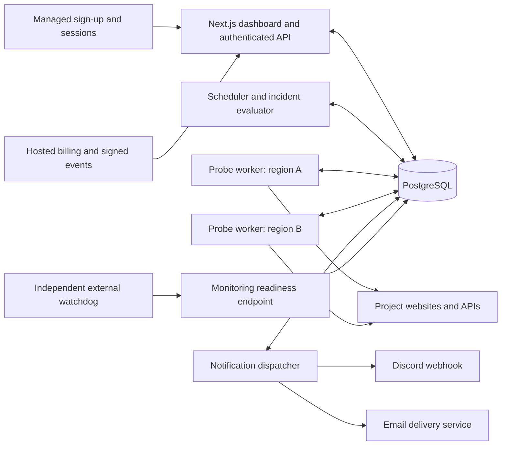

# Multi-tenant uptime SaaS: proposed design and delivery plan

> Superseded by [the personal monitor design](2026-09-04-simple-uptime-design.md). The user removed SaaS scope and selected local testing followed by VM hosting.

Date: 4 September 2026. Status: proposed for review. Research: [official service comparison](../../research/2026-09-04-uptime-services.md).

## Goal and initial scope

Build a Next.js/React uptime monitoring service where people register, create their own workspaces and projects, monitor their websites and APIs, and configure Discord webhook and email notifications. The product supports the founder's projects and independent customers through the same customer workflows. Workspaces are the ownership, authorization, quota, and subscription boundary.

Planning assumptions: public registration with verified identities; multiple independent workspaces; public internet endpoints; production and staging labels; 60-second paid checks and configurable slower checks. The initial beta capacity target is 100 total active monitors across at least ten workspaces. A commercial expansion target is 1,000 total active monitors across at least 50 workspaces, with workers scaled and admission limits adjusted only after validation. These are fleet-wide validation targets, not per-customer allowances or measured capabilities. Monitoring runs independently of the projects being monitored and independently of dashboard deployments.

The first public beta includes registration, verification, onboarding, workspace isolation, roles/invitations, enforced trial limits, project management, HTTP checks, content/JSON assertions, incident history, response-time charts, maintenance windows, Discord/email routing, delivery diagnostics, and monitoring-system health. A paid launch additionally requires the subscription/payment lifecycle, customer billing controls, operating procedures, and commercial capacity validation. Payment collection is a separate release gate; the underlying entitlement model is part of the foundation.

## Architecture options

| Approach | Advantages | Tradeoff | Decision |
| --- | --- | --- | --- |
| Next.js plus separate persistent Node.js workers and PostgreSQL | Full control; portable; checks survive dashboard deployments; shared TypeScript | Workers and database need ongoing operations | Recommended |
| Custom Next.js dashboard over an existing monitoring service API | Fastest path to mature external probes | Vendor plans, API behavior, and incident model constrain the custom product | Useful if minimizing operations becomes the priority |
| Dashboard plus serverless scheduled checks | Fewer persistent processes | Scheduling precision, concurrency, retries, and frequent function/database activity need more care | Prefer only with a deliberately chosen durable scheduler and cost model |

Vercel cron has documented concurrency, delivery, retry, and Hobby-frequency limits. Persistent workers are the recommendation for the monitoring loop. [Cron documentation](https://vercel.com/docs/cron-jobs/manage-cron-jobs).

## Components and deployment



Use a TypeScript workspace with a Next.js App Router web app, a worker app with selectable roles, and shared monitoring/database/notification packages. Use PostgreSQL for configuration, scheduled work, results, incident transitions, and notification delivery records. A separate Redis service is unnecessary at the initial target.

The scheduler, evaluator, probe, and dispatcher are explicit roles. Their deployments can share worker hosts while keeping separate process health and database permissions. Probe processes do not receive email or Discord credentials. Shared libraries contain behavior, with no dependency on React or Next.js request state.

Recommended production topology: a separately deployed dashboard; PostgreSQL with backups; probe workers in two independently hosted networks/regions; redundant scheduler/evaluator/dispatcher processes using database leases. Prefer a probe near the users, such as Southeast Asia, and another independent region. Exact hosts are selected after confirming available infrastructure and budget. Dashboard hosting can be Vercel or a Node.js/Docker host.

Both regions run each monitor at its entitled cadence: initially 60 seconds for paid plans and 300 seconds for the trial. Two locations establish two observed perspectives, not worldwide availability. Single-region development is allowed with a visible coverage limitation; production confirmation requires the second probe to be deployed and healthy.

Database failure remains a shared dependency. During that failure, workers back off, readiness fails, and gaps are recorded after recovery. An external watchdog must alert via an independently operated email path. It must check useful progress such as scheduler/probe/dispatcher freshness, not only whether an HTTP process answers.

## Project model and reuse

The hierarchy is account → workspace memberships → project → environment → monitors. One account can belong to several workspaces. Each workspace has its own subscription, projects, destinations, data, and members. A member sees the all-sites dashboard for the selected workspace. Examples within a project include a public website monitor and a separate API health monitor. A monitor is a check; several checks can cover one website, so the interface must not describe monitor count as unique website count.

Every project owns:

- Its monitors and environment labels.
- Default Discord/email destinations and notification policy.
- Default cadence, timeout, tags, and maintenance settings.
- Incident history and aggregate health.

Monitors inherit project policy unless explicitly overridden. An override replaces the inherited destination set; the UI shows the effective destinations before saving. Reusing one workspace destination across projects is allowed. Creating another project never implicitly subscribes it to every existing destination.

Public registration uses managed authentication. Recommend Clerk for identity verification, sign-in, session management, and recovery; it appeared in live authentication integration discovery and provides a Next.js integration. The application database remains authoritative for workspace membership, roles, and product entitlements. Avoid maintaining independent competing role systems in both the identity provider and application. Identity-provider changes do not change the data's workspace ownership. [Clerk organization concepts](https://clerk.com/docs/guides/organizations/overview).

New users register, verify their email, name a workspace, select their timezone, create a project, verify the target hostname, add a monitor, and confirm notification destinations. Email/password and supported social sign-in are suitable entry points; use the provider's account-linking and recovery controls. Do not merge accounts solely because an unverified email string matches. Workspace creation/onboarding is idempotent so retrying signup cannot issue duplicate trials.

## Workspace roles and isolation

| Role | Permissions |
| --- | --- |
| Owner | Everything in the workspace, billing, invitations and role changes, ownership transfer, workspace deletion |
| Admin | Manage projects, monitors, destinations, and maintenance; acknowledge incidents; read reports |
| Viewer | Read the workspace's monitoring dashboard and incident reports; no configuration changes or secret access |

Each workspace has one owner. Ownership transfer is atomic and requires the new owner's acceptance. An owner must transfer ownership or delete the workspace before leaving it. Invitation tokens are single-use, expire after seven days, bind to the verified invited email, and reserve a plan seat. Removing or downgrading membership takes effect at server authorization boundaries immediately. Invite acceptance rechecks seats and cannot grant a role higher than the invitation's recorded role.

Members have access to the selected workspace's projects according to their role. Per-project private membership is deferred; customers needing separate client access use separate workspaces. Notification recipients can be verified contacts without dashboard access and do not automatically become members.

Derive the authenticated user from the verified session and resolve workspace membership on the server. A URL parameter or client-supplied workspace identifier chooses a candidate workspace, never grants access. Every query, mutation, aggregate, export, cache entry, background job, and notification is scoped to the authorized workspace. Switching workspaces clears tenant-specific client state and revalidates access. Return a uniform not-found response for inaccessible resource IDs.

Use `workspace_id` throughout customer-owned tables, composite ownership foreign keys, and PostgreSQL row-level security as a second enforcement layer. The web runtime role is neither a table owner nor a superuser and has no `BYPASSRLS`; enforce RLS on applicable tables. Set tenant context transaction-locally from authenticated server state and never let pooled connections retain another request's context. Tenant-filtered application access and RLS are both tested. [PostgreSQL row security](https://www.postgresql.org/docs/current/ddl-rowsecurity.html).

Global scheduling uses restricted machine credentials and narrowly scoped job-claim/result interfaces. A probe can receive only the selected task configuration and required endpoint credential. It cannot enumerate customer billing, identities, or notification secrets. Outbox deliveries carry a workspace and destination version and must pass an ownership check before credentials are loaded. Worker identity, job ownership, and fencing tokens remain mandatory even though the background fleet serves all customers.

Application isolation must cover caches, files, asynchronous work, and operational access as well as database reads. These are explicit testing boundaries. [OWASP multi-tenant guidance](https://cheatsheetseries.owasp.org/cheatsheets/Multi_Tenant_Security_Cheat_Sheet.html).

## Product plans and subscription lifecycle

Charge per workspace with simple plan limits. Every plan includes Discord and email. The following are proposed packaging defaults; prices are set after measuring unit costs and confirming payment-provider availability.

| Package | Projects | Non-archived monitors | Fastest cadence | Members | Regions |
| --- | --- | --- | --- | --- | --- |
| Trial, 14 days | 1 | 3 | 5 minutes | 1 | 2 |
| Starter | 5 | 10 | 1 minute | 1 | 2 |
| Team | 20 | 50 | 1 minute | 5 | 2 |

One trial is issued per verified account, beginning on first monitor activation. Additional owned workspaces require their own entitlement and do not repeatedly restart a trial. An expired trial retains a read-only dashboard for 30 days with an explicit upgrade/export message, then follows the published inactive-data policy. Any extension is an audited, expiring platform action.

Represent plan entitlements as versioned server data: project/monitor/member limits, minimum interval, allowed regions, retention access, and notification/test budgets. Enforce them at creation, activation, updates, invites, imports, scheduling, and dispatch. Concurrent creates reserve quota atomically. Paused monitors still count toward the non-archived configuration limit. Archive/create churn and workspace creation have separate abuse limits. No automatic paid overages at launch.

Use a hosted checkout and billing portal for subscriptions, payment-method updates, invoices, upgrades, and cancellation. Stripe is the preferred integration if the business is eligible; live payment discovery returned Stripe. Merchant country and business eligibility must be confirmed before committing to it. Customer location and merchant eligibility are different questions. No processor has been provisioned. [Stripe availability](https://stripe.com/global).

The billing provider is authoritative for payments. Store a local, versioned entitlement projection per workspace. Verify signed webhook bodies, persist and deduplicate provider event IDs, acknowledge only after durable receipt, then reconcile subscription state. Events can repeat or arrive out of order; reconcile against current provider state rather than overwriting newer entitlements with an older event. Never enable a paid plan from a checkout success URL or browser-supplied price. Bind allowed price IDs and the customer/subscription mapping to a server-authorized workspace. [Subscription webhooks](https://docs.stripe.com/billing/subscriptions/webhooks), [webhook delivery behavior](https://docs.stripe.com/webhooks).

An active trial grants trial access. Successful initial payment grants paid access only after server verification. Renewal failure enters a disclosed three-day grace period and alerts the owner; monitoring continues during grace. After a confirmed unpaid terminal state or expired grace, suspend checks and show “Monitoring suspended — billing action required.” A provider outage alone does not prove nonpayment: preserve last verified access temporarily, bound that extension to 72 hours after the known paid-through time, and raise an operator issue. Do not silently claim a suspended site is down or recovered.

Cancellation normally takes effect at the paid period's end. Downgrades also take effect at the next period boundary: preview excess resources and let the owner select the monitors/members to retain. If no selection is made, use a displayed deterministic oldest-created-first order, always retaining the owner; keep excess records read-only rather than deleting history. Suspend excess checks explicitly. Upgrades wait for confirmed provider state. Dashboard/export access remains available for 30 days after cancellation before the published deletion policy applies.

Track payment/entitlement state separately from monitor health. Keep immutable usage counters for scheduling volume, retries, notification sends, and retained data so proposed pricing can be checked against real cost. Trial grants and manual complimentary access are audited entitlements, not untracked bypasses.

## Public-service abuse and fairness controls

Registration, verification mail, password recovery, invitations, workspace creation, manual probes, and notification tests have server-side rate limits. Gate recurring checks behind verified identity and target authorization. Require hostname control through a DNS TXT token or a bounded `.well-known` challenge before enabling recurring checks. Authorized third-party health endpoints require an explicit platform allowlist or reviewed exception. Verification only proves configured scope and never disables SSRF protections.

Allow public HTTP(S) on ports 80/443 initially. The verification request uses a bounded known challenge path and the same network protections as every probe. Additional redirect hostnames need explicit authorization; never follow a customer URL into an unvalidated host or private network. A hostname change invalidates its previous authorization. Recheck authorization periodically and immediately after suspicious DNS/target changes.

Protect the monitoring fleet and other internet services with per-workspace, per-origin, and global destination-IP request budgets, bounded payloads, fixed timeouts, and per-tenant queue shares. One customer cannot occupy all available workers or grow an unlimited backlog. Keep separate fair scheduling for probes and notifications. Capacity admission must respect purchased deadlines; offer a waitlist if the beta fleet is full rather than accepting obligations it cannot meet. Test a noisy tenant alongside healthy tenants.

Email recipients verify an invitation before they receive ongoing alerts. A Discord destination needs a successful test and confirmation by its workspace administrator. Cap manual probes at five/minute/workspace, notification tests at three/destination/hour and ten/workspace/hour, and pending email-contact invitations at ten/workspace. These are initial abuse caps, separate from the provider's stricter limits. Restrict mentions; do not allow arbitrary mass mentions in alert templates.

Apply bounded alert budgets and coalesce bursts for the same workspace/destination within five seconds, preserving incident references. Never combine different customers' events. Reserve capacity for opening/recovery events, cancel stale reminders first, and show delayed/suppressed deliveries explicitly if a cap is reached. Suppression never falsifies the dashboard. The platform can suspend an abusive workspace or destination immediately with an audit reason.

## Monitoring behavior

| Setting | Proposed initial default |
| --- | --- |
| Cadence | Paid: 60 seconds per region, optionally slower; trial: 300 seconds minimum |
| Method | GET; HEAD can be explicitly selected |
| Success | Final 2xx response and all configured assertions pass |
| Timeout | 10 seconds across the complete attempt, including redirects/body assertion |
| Redirects | At most 5, with destination validation at each hop |
| Failed attempt | One retry after 10 seconds in that same region |
| Production coverage | Two independently hosted regions per scheduled round |
| Round completion deadline | 55 seconds after its scheduled time |
| Stable recovery | Two consecutive complete healthy rounds |
| Stale display threshold | 2 × check interval + request timeout since the latest complete round |
| Dashboard refresh | Every 15 seconds while visible, with last-updated time |

Workers spread monitor schedules over each interval, enforce per-workspace and per-host request limits, and cap concurrent work. Start with a configurable maximum of 50 concurrent attempts per worker, subject to the capacity test, and scale worker replicas by measured demand. A sustained outage produces bounded confirmation retries; it does not create an unbounded request storm. Later 30-second support needs its own timeout/deadline/capacity validation.

Support exact status-code overrides, required text, and bounded JSON field assertions. Use TLS verification. Limit decompressed response bodies to 256 KiB and stop reading once sufficient evidence is collected. Record network/TLS/timeout/status/assertion error categories, response times, region, and timestamps. Response bodies and credentials are not stored by default. A body exceeding the assertion limit is reported as an assertion/configuration limitation, not silently accepted.

For API health, prefer a lightweight read-only endpoint that validates critical dependencies and returns a non-success status when unhealthy. Avoid expensive database scans. A website returning its usual cached page cannot alone prove its API or background worker works. Health endpoints should disable inappropriate caching; leave ordinary public-page checks representative of what users receive.

### State and incident rules

Each scheduled round has one terminal outcome per region after its bounded retry. Outcomes are evaluated together:

| Evidence | Health outcome |
| --- | --- |
| Both regions pass | Up; during an incident, begin/continue recovery verification |
| Both regions fail after retry | Down; create or continue one availability incident |
| One region fails after retry and the other passes | Degraded; preserve which region failed |
| A required region has no valid outcome by the deadline | Unknown; show the evidence that was received and the missing coverage |
| Checks intentionally suspended | Paused |
| A configured maintenance window is active | Maintenance overlay, preserving the observed health beneath it |

One transient failed attempt followed by a successful retry is recorded diagnostically and does not itself open an incident. Regional degradation opens one warning incident after two consecutive complete mixed rounds. A Down event opens immediately after the two confirmed regional failures. Recovery requires two consecutive complete rounds with both regions passing; an intervening failure or incomplete round resets the healthy count.

If a warning becomes a full outage, retain the incident and record severity escalation. If an outage improves to regional degradation, retain it until full recovery, updating the observed status. Alert only on opening, escalation to Down, optional reminders, and full recovery. Missing data never resolves an incident. A stopped scheduler forces an Unknown presentation once the stale threshold expires even if the stored prior status was Up.

Incident records distinguish first observed failure, confirmation time, first observed recovery, and resolution time. These are sampled observations, not exact knowledge of when the site's real outage began. The dashboard may show “checking recovery” while the incident remains open. Acknowledge marks human awareness and suppresses reminders; it does not change uptime or force recovery.

### Durable scheduling and transitions

Persist scheduled rounds and regional jobs before execution. Enforce uniqueness for `(monitor_id, config_version, scheduled_at, region_id)` and attempt numbers. Claim due work in short transactions using row locks/`SKIP LOCKED`, persist a lease/fencing token, commit, then perform network work. Never hold a database transaction open during HTTP calls. [PostgreSQL queue locking](https://www.postgresql.org/docs/current/sql-select.html).

Lease expiry allows another worker to reclaim work. A stale worker cannot overwrite a newer owner or publish a second authoritative result. The evaluator locks the monitor state, applies a transition once, and creates outbox deliveries in the same transaction. A partial unique constraint permits at most one unresolved availability incident per monitor.

After downtime, schedule the next current check and mark missed slots Unknown. Do not run historical HTTP requests as though they measured the past. Discard late results from live state after the round deadline, retaining them only as diagnostic evidence. Config changes version new rounds; results from previous settings cannot mutate the new configuration's health. A pause, archive, or incompatible URL/assertion change supersedes pending rounds and cancels unsent notifications with a recorded administrative reason. An administratively closed incident must not generate a recovery claim.

## Discord and email notifications

Discord and email are the only launch channels. “Webhook call” means an HTTP request to Discord, with no voice-calling feature.

Project defaults send confirmed Down and Recovery events to both channels. Regional degradation sends one warning after its confirmation rule. Reminders are disabled by default; workspace owners/admins can enable a 30-minute reminder. Expired destinations or provider failures appear separately from site health. Workspace billing and account-security emails are distinct transactional events with their own routing to the owner or affected account.

Every message includes workspace, project, environment, monitor name, safe URL, severity/status, observed error category, regions, incident start time, elapsed duration, and a dashboard incident link. Recovery includes outage duration. Store UTC; dashboard timestamps use the viewer's timezone and alerts use the workspace timezone, selected during onboarding. Do not impose the founder's timezone on other customers. Do not include secrets, URL query credentials, or response bodies in notifications.

Destinations are encrypted at rest and masked after entry. Webhook URLs are submitted once over authenticated HTTPS to the server; subsequent responses never return the secret. The backend performs delivery and redacts logs. Deduplicate identical effective recipients/webhooks within each workspace without disclosing that another customer uses the same address or webhook. Each recipient/channel has its own delivery state and retries so Discord failure cannot block email.

**Discord:** use the documented webhook endpoint with `wait=true`, persist the returned message ID, and restrict `allowed_mentions`. Serialize sends per webhook and obey server rate-limit headers. A 429 follows `retry_after`; transient 5xx/network failures use bounded exponential backoff with jitter. Invalid/revoked webhooks require attention instead of endless retries. [Webhook API](https://docs.discord.com/developers/resources/webhook#execute-webhook), [rate limits](https://docs.discord.com/developers/topics/rate-limits).

**Email:** recommend Resend, which was returned by live Marketplace messaging discovery. Provision it during approved implementation. Use a verified sending subdomain, the provider's DNS authentication instructions, and an explicit DMARC policy. Send separately per recipient to avoid leaking recipient lists. Disable open/click tracking for incident alerts. Maintain stable idempotency keys and ingest signed, deduplicated delivery/bounce/failure callbacks. [Sending domains](https://resend.com/docs/dashboard/domains/introduction), [idempotency keys](https://resend.com/docs/dashboard/emails/idempotency-keys), [email delivery events](https://resend.com/docs/webhooks/event-types).

Use a durable outbox keyed by incident event, destination, and reminder sequence. Retain local deduplication beyond the email provider's 24-hour idempotency window. Limit automatic retry age to one hour and attempts to eight; after that, mark attention required. Provider acceptance, mail-server delivery, retrying, uncertain delivery, and permanent failure are distinct states. Do not claim a person received or read an email based on API success.

Discord does not provide an end-to-end exactly-once guarantee for these webhook sends. A timeout after acceptance can lead to a duplicate on retry. Persist attempts and stable incident/event references, bound retries, and expose uncertainty. No design claim should promise zero duplicates.

Preserve event order per incident/destination without blocking unrelated incidents. Cancel stale reminders after recovery. If an incident resolves before any opening notification is accepted, coalesce unsent events into one “outage occurred and recovered” summary. An uncertain prior send remains explicitly uncertain. A destination added mid-incident receives a current-state summary if the owner enables that action.

Provide a “Send test” action using the real notification pipeline. Show submitted/accepted/delivery status accurately. Channel failures can generate one deduplicated monitoring-system warning through the other working channel; never create recursive alert loops.

## Dashboard and workflows

The product has public landing, plan-comparison, registration, and sign-in pages. The authenticated landing view is an all-sites/checks table for the active workspace, grouped or filtered by project, with a workspace switcher. Put active incidents and coverage failures first. Use text/icon status indicators alongside color.

| View | Required content |
| --- | --- |
| Overview | Counts for healthy, down, degraded, unknown, paused, and maintenance; active incident banner; all monitored URLs |
| Site/check row | Name, hostname, project, environment, health, latest response time, 24-hour/30-day availability, coverage, last check, short history bar |
| Project | Project checks, effective destinations, defaults, maintenance, incidents |
| Monitor details | Regional results, response-time chart, uptime history, expected behavior, incident timeline, evidence, notification deliveries |
| Notifications | Masked destinations, effective routing, last delivery/test outcome, retry/attention status |
| Workspace settings | Verified identity, workspace timezone, members/invitations, roles, owner controls, account/workspace export and deletion |
| Usage and billing | Effective plan, quota usage, trial/grace expiry, invoices, upgrade/downgrade/cancel actions for the owner |
| Monitoring coverage | Customer-safe regional freshness and service-health notices without fleet secrets or other customers' data |
| Platform operations | Restricted operator view of scheduler/probe freshness, work backlog, database readiness, dispatcher progress, abuse and billing issues |

Filters cover project, environment, health, tags, and search by name/hostname. Save filtering in the URL. Provide pagination, responsive mobile cards, explicit loading/error/empty states, and accessible keyboard navigation. Show fresh data without caching private monitoring status at a public CDN.

Adding a project: select the workspace, check available quota, name it, choose environments, configure verified destinations, add and authorize URL targets, validate settings with a real on-demand probe, test notifications, and enable monitoring. No code change or redeploy is required. Manual probes are rate limited and clearly identified; they do not inflate scheduled availability statistics or force incident recovery.

## Availability, maintenance, and retention

Calculate reports from fixed scheduled monitoring slots. Confirmation retries do not create additional voting weight. Report per-region observations and a combined outcome; preserve the selected policy/config version.

Maintain durations for Up, Degraded, Down, Unknown, Paused, and Maintenance. For eligible scheduled time, observed availability is `(Up + Degraded) / (Up + Degraded + Down)`. Coverage is `(Up + Degraded + Down) / eligible scheduled time`. Unknown stays in the coverage denominator and outside the availability denominator. Show Degraded duration separately, since combined availability can be high during regional failure. If no known observations exist, show an em dash rather than 100%.

Paused time and configured maintenance time are excluded from adjusted availability, with exclusions displayed. Preserve an additional inclusive view of observed maintenance failures; maintenance must not erase evidence. Continue checks during maintenance while suppressing related alerts. At the end, recheck and alert if a confirmed problem remains. An incident already open before maintenance remains traceable. Recurring windows use an IANA timezone so daylight-saving transitions are handled consistently.

Current state and rollups serve dashboard requests; opening the overview does not scan all raw checks. Proposed retention: raw attempts for 14 days, hourly aggregates for 90 days, daily aggregates for two years, incident/audit metadata for two years, and detailed notification attempts for 90 days. Partition raw time-series records by day and remove old partitions only after successful rollup. Maintain histograms or sufficient samples for combined latency percentiles; never average p95 values. Exclude failed attempts from successful-latency percentiles and display timeout counts separately.

At 100 monitors, two regions, and 60-second checks, the baseline is 288,000 probe requests/day or 8.64 million per 30 days, before retries and extra probes. The 14-day raw baseline is about 4.03 million results. At 1,000 monitors the figures increase to 2.88 million/day, 86.4 million/30 days, and approximately 40.32 million raw results for 14 days. These are arithmetic volume estimates for an all-60-second fleet. Trial intervals reduce volume. Storage bytes, database writes, latency, costs, and per-workspace fairness must be measured before admitting that customer volume.

Retention is a maximum for active workspaces and is superseded by the approved deletion policy. User-account deletion removes that person's access and personal profile; it does not delete other members' workspace history. An owner deleting a workspace must resolve subscription cancellation, stop jobs, revoke destinations/tokens, and confirm the action after reauthentication. Purge live tenant data within 30 days; encrypted backups expire on a documented maximum 35-day cycle, and restored backups must replay deletion tombstones. Billing records follow a separately published retention policy selected before paid launch.

## Data and code boundaries

Core records: workspaces, user identities/memberships, invitations, target verifications, verified contacts, projects, environments, monitors/config versions, destinations/project routes, scheduled rounds/regional jobs, probe attempts, current monitor state, incidents/events, notification outbox/attempts, maintenance windows, rollups, worker heartbeats, and audit events. Commercial records include plans/entitlement versions, trial grants, subscriptions, billing customers, provider event inbox, usage counters, quota reservations, suspension reasons, and deletion tombstones.

Use foreign keys and ownership constraints to keep monitor, project, and destination references in one workspace. Index workspace-scoped lists, due pending jobs, unfinished deliveries, open incidents, and monitor/time history. Apply small connection pools per worker and a pooler suitable for web deployment; do not create a new database connection per check. Runtime database roles have no migration privileges. Managed PostgreSQL is recommended; Neon is a candidate returned by storage discovery, subject to validating sustained write volume and cost. The engine uses standard PostgreSQL behavior so hosting can change without rewriting tenant ownership or monitoring policies.

Proposed file organization:

```text
apps/web/src/app/                 dashboard pages and authenticated handlers
apps/web/src/features/            onboarding, workspaces, projects, monitors, incidents
apps/web/src/features/billing/    usage, plan selection, checkout and billing portal
apps/web/src/features/platform/   separately authorized operator workflows
apps/worker/src/scheduler/        due rounds, deadlines, lease recovery
apps/worker/src/probes/           bounded HTTP requests and regional outcomes
apps/worker/src/incidents/        transitions, recovery, maintenance policy
apps/worker/src/dispatch/         durable notification delivery
packages/monitoring/src/          shared policies, validation, state, metrics
packages/db/                     schema, migrations, queries, leases, rollups
packages/notifications/src/      Discord and email adapters and formatting
packages/access/src/             workspace authorization and roles
packages/billing/src/            plan entitlements, quotas, provider reconciliation
tests/integration/               database races, workers, provider failure cases
tests/e2e/                       registration, cross-workspace isolation, roles, billing
deploy/                          worker containers and operating instructions
```

Shared contracts distinguish `ProbeAttempt`, `RegionalOutcome`, `RoundOutcome`, `IncidentEvent`, and `NotificationDelivery`. IDs, timestamps, configuration version, probe identity, and ownership accompany records crossing boundaries. Notification adapters consume normalized events and return accepted/retryable/permanent/uncertain outcomes. The Next.js app never imports a background loop.

## Security and operating requirements

Protect every server read/mutation with authorization, use a maintained authentication/session library, secure cookies, and verify webhook signatures. Audit configuration and destination changes. [Next.js authentication guidance](https://nextjs.org/docs/app/guides/authentication).

For public probes, allow HTTP(S), reject URL credentials and nonpublic destinations, validate both IPv4/IPv6 DNS answers, bind the actual connection to a validated address while preserving hostname/TLS checks, and revalidate each redirect. Use network egress controls as another layer. Do not forward authorization headers/cookies across origins. Limit response bytes, redirect count, runtime, requests per target, and total concurrency. These controls address the URL-fetching risks described by [OWASP](https://cheatsheetseries.owasp.org/cheatsheets/Server_Side_Request_Forgery_Prevention_Cheat_Sheet.html).

Private-network monitoring requires a separately scoped private agent in a later release. Do not weaken the public worker's protections to reach internal systems. Keep monitoring database connectivity separate from the target-request path. Encrypt per-monitor auth secrets and expose only the minimum required secrets to each role.

Run workers with restart policies, graceful shutdown, UTC/NTP time synchronization, bounded logs, database backups, and a tested restore procedure. Use compatible schema migrations so dashboard and worker deployments can be rolled independently. Publish monitoring source IPs if stable allowlisting is required by a project's firewall.

Platform operators use separate authorization and mandatory MFA. Their default dashboard exposes fleet/usage/billing status and sanitized diagnostics, not unrestricted customer content. Any support access is explicitly scoped, time-limited, and audited. Customer owners/admins can enable MFA through the identity provider, and sensitive owner/billing/deletion changes require recent authentication. Keep operator privileges out of customer role claims.

## Delivery sequence and verification

This is the product/design plan. Detailed implementation steps and final dependencies follow design approval; no application code or infrastructure has been created.

| Stage | Deliverable | Meaningful acceptance evidence |
| --- | --- | --- |
| 1. SaaS foundation | Registration/verification, workspace onboarding, membership/roles/invites, RLS, project configuration, entitlement model | Two unrelated customers cannot read, mutate, aggregate, or route alerts into each other's workspace; role changes/revocation work; signup/invites cannot exceed quotas |
| 2. Reliable monitoring | Persisted scheduling, two probe identities, evaluator, current state and history | Healthy, 500, timeout, invalid TLS, redirects, failed assertion, regional split; missed/late/duplicate jobs; recovery sequence |
| 3. Discord and email | Tenant-safe routing, verified contacts, durable outbox, adapters, test action, callbacks, abuse caps | Correct customer/destination receives events; no cross-tenant payloads; 429/5xx, revoked webhook, bounce, restart, burst grouping and recovery ordering |
| 4. Customer dashboard and trial | Overview, project details, filters, charts, incidents, maintenance, workspace switching, usage/expiry | Two independent customer journeys; mobile/desktop; role restrictions; Unknown/errors visible; quota concurrency and trial expiry |
| 5. Public beta operations | Independent probes, watchdog, target authorization, retention, restore/deletion, fair queues | Worker/scheduler/dashboard/database failures; SSRF/abuse prevention; noisy tenant isolation; 100-monitor beta capacity gate |
| 6. Paid launch | Eligible payment processor, hosted checkout/portal, verified billing events, entitlements, cancellations, owner controls | Initial/renewal payment, duplicate/out-of-order events, failed payment/grace, provider outage, downgrade/cancellation, no cross-workspace subscription changes |

Detailed implementation planning should be split into foundation, monitoring, notifications/dashboard, and commercial-release work packages with explicit interfaces. Public beta depends on stages 1–5. Paid access depends on stage 6 and the agreed commercial capacity/operations gate; public registration does not by itself mean the service is ready to sell.

Use unit tests for state, metrics, authorization policies, quotas, and entitlement transitions; database integration tests for RLS, ownership constraints, locks/uniqueness/outbox recovery; and browser tests for separate customers and roles. Exercise guessed resource IDs, cross-workspace caches/exports, stale sessions, removed members, forged workspace IDs, background job/destination mismatches, and forged billing callbacks. Test SSRF protections with loopback, private IPv4/IPv6, redirect-to-private, DNS rebinding simulations, and cross-origin secret stripping. Keep these focused on observable requirements.

Beta capacity gate: simulate 100 monitors across at least ten workspaces in two regions, including a sustained all-timeout scenario, using controlled fixtures. Commercial expansion gate: repeat at 1,000 monitors across at least 50 workspaces with the proposed worker/database sizing. Check per-tenant backlog, deadlines, retries, concurrent quota operations, database connections, and a noisy tenant. Target p95 scheduler lateness under five seconds under the agreed fixture workload. Under healthy dependencies and within published alert budgets, confirmed events should be offered to both providers within ten seconds at p95, including any five-second aggregation window. These are proposed acceptance targets requiring measurement, not vendor delivery guarantees.

Production readiness includes demonstrating that checks and notification dispatch continue during a dashboard deployment, and that the external watchdog can report a stalled monitoring system. Before selling, publish actual plan limits, retention/deletion behavior, cancellation/grace rules, privacy/terms, support contact, and an independent service-status page. Confirm payment eligibility and measure infrastructure, auth, email, payment, and support costs before pricing; do not advertise an uptime SLA that has not been defined and supported operationally. A temporary functional harness is sufficient for capacity validation.

## Deliberately deferred features

Customer-facing public status pages, SSL-expiry reminders, job heartbeats, scheduled report emails, scoped automation tokens/import/export, and project templates are sensible next additions. Per-project private membership, enterprise SSO, custom customer domains, browser transaction monitoring, arbitrary custom scripts, private-network agents, and a larger global probe fleet require separate designs. Registration, workspace roles, entitlement enforcement, and the paid-launch billing flow are in scope as described above.

## Decisions for the next discussion

Recommended defaults are public verified registration, isolated workspaces with Owner/Admin/Viewer roles, workspace subscriptions, a 14-day bounded trial, 60-second paid checks, two production regions, managed PostgreSQL, Clerk authentication, and Resend email with project-level Discord/email routing. Before implementation, confirm existing VPS/container infrastructure or include hosting selection. Before selecting the payment integration, confirm the business's merchant country and entity eligibility. Prices follow measured unit costs. Actual integration credentials and sending-domain verification are required at integration/deployment time; customers supply and verify their own notification destinations through onboarding.

If Vercel hosts the dashboard, install the CLI with `npm i -g vercel` for `vercel env pull`, `vercel deploy`, and `vercel logs`. Read-only integration discovery during research used a temporary CLI invocation. Provisioning and costs remain subject to the selected deployment.
